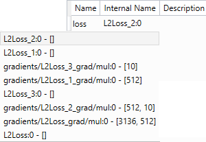

# Generate code from trained models

Building intelligent applications in Visual Studio is as easy as adding your pre-trained model to your app, just like any other library or resource. Visual Studio Tools for AI generates code from your trained model to make it easy to get started, and includes the [Microsoft.ML.Scoring](https://www.nuget.org/packages/Microsoft.ML.Scoring/) library that offers simplified consistent APIs across TensorFlow and ONNX models.

The library allows users to automatically optimize their models for model serving, improving the model size for use in inferencing applications. Moreover, Visual Studio Tools for AI generates a C# stub class to simplify interaction with models in your app. These Model Inference Library projects can be further deployed as NuGet packages for convenient distribution.

## Supported model framework versions
Visual Studio Tools for AI supports building apps using Tensorflow and ONNX models. Currently, the following versions are supported:

-   ONNX
    -   Version: 1.0.1
    -   CPU (Intel MKL enabled) only
-   TensorFlow
    -   Version: 1.5.0
    -   CPU (Intel MKL enabled) only
    -   Model formats: checkpoint and saved model only. Frozen model is not supported.
        -   For TensorFlow Checkpoint - all files including a checkpoint file, a meta file, and data files should be stored under the same folder. If your model contains TensorFlow lookup operations, please copy your vocabulary file to this folder as well.
        -   For TensorFlow SavedModel - all files including a pb file, data files and asset files should be stored under the same folder. Please do not import SavedModel files that were previously optimized by the library -this can result in unexpected errors.

> [!NOTE]
>
> [Intel MKL](https://software.intel.com/en-us/mkl) is licensed under the [Intel Simplified Software License](https://software.intel.com/en-us/license/intel-simplified-software-license).

## How to Create a Model Inference Library Project

In order to enable easy integration of pre-trained models into .NET applications, Visual Studio Tools for AI allows users to create a C# wrapper over the raw model files. This offers simplified consistent APIs for user-friendly project reference.

Please install Python, [set the default Python environment](prepare-localmachine.md#setting-up-the-default-python-environment) globally for Visual Studio, and ensure TensorFlow package has been installed in the default environment.

First, create a new C# project using the Model Inference Library template.

Fill in the solution name and project name you like. Click OK button.

Then, the 'Create Model Inference Library Wizard' pops up allowing you to import a raw deep-learning model to the project.

Name, version, and description are all required fields as the model meta information.

+ Name: It should match regular expression “^[a-zA-Z][a-zA-Z0-9_]+$” because it will be used as the class name of the auto-generated model wrapper.
+ Version: This (an integer) helps ML Scoring Library distinguish the latest model.
+ Model path: It is the file path of saved model files. For TensorFlow, you should choose either Checkpoint .meta file or SavedModel .pb file as the library uses it to extract real inference graph and parameter values.
+ Description: Include an explanatory description of the what the model accomplishes.
+ Enable Optimizations: Selecting this checkbox prunes the whole graph into a smaller one needed for inference to improve performance.

In addition to meta info, the tensor/operation name of input and output in your model should be explicitly specified. This tells the ML scoring library which node to feed data and which node to fetch result in an inference DAG. 

When you select a file as model path, the Wizard will analyze it including interfaces and asset files. If the input is a SavedModel, then most fields can be filled automatically without your involvement.

However, you still need to check whether the values Wizard detects from the model are correct. If the Wizard cannot find interface by analysis, you can create multiple interfaces describing the inputs and outputs of your model by clicking the Add button beside to Interfaces table.

In the interface editor dialog, please provide required data fields:

+ Name: It should match regular expression “^[a-zA-Z][a-zA-Z0-9_]+$” as it will map to a method name of the wrapper class created. For C# convention, the first character can be capitalized.
+ Inputs: This is collection of nodes in inference graph that holds input data like text, image, audio. The name column is the friendly name used in C# code and description is optional. Most important field is the internal name which is the full name of the input tensor or operation set by your training toolkit like TensorFlow or CNTK.
+ Outputs: This is collection of nodes in inference graph that produces result like category, value. Columns share the same semantic definition as that of Inputs.

    

The Interface Editor provides auto completion feature for your finding proper internal names. Typing several characters in the target TensorFlow operation name, a dropdown list will pops up and you can select the right one in this interface.

After filling all required fields, just click the OK button in the Wizard and Visual Studio client begins to create project, add ML scoring NuGet reference, prepare content files and generate code template that wraps interfaces of the model imported.

