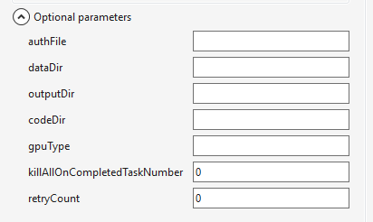

[PAI(Platform for AI)](https://github.com/Microsoft/pai) is a cluster management tool and resource scheduling platform, jointly designed and developed by Microsoft Research (MSR) and Microsoft Search Technology Center (STC). The platform incorporates some mature design that has a proven track record in large scale Microsoft production environment, and is tailored primarily for academic and research purpose.

## Add a PAI cluster 
To add a PAI cluster, right click PAI node and select "Add Cluster…". Users need to provide cluster display name, cluster IP address, user name and password. 

   

## Job Submission to a PAI cluster 
To submit a job to PAI cluster, right click on the project node in Solution Explorer and select "Submit Job" menu.

   

In the submission window:

1.  In the list of "Cluster to use", users select a target PAI cluster.

1.  The "Startup script" is your entry point script path relative to your project directory.

1.  The "Job Name" allows users to enter a name for this job to show it up in the cluster targeted. It needs to be unique.

1.  Users are required to provide a docker image name in image textbox, which is used to run docker containers in the job.

Task Roles:
1.  The "name" is the name for the task role, need to be unique with other roles.

    

Optional Parameters:

1.  The "authFile" is Docker registry authentication file existing on HDFS. It's optional.

1.  The "dataDir" is the data directory existing on HDFS, used for storing job input data on HDFS. It's optional.

1.  The "outputDir" is the output directory on HDFS, used for storing job output files on HDFS. It's optional.

1.  The "codeDir" is the code directory on HDFS, used for storing user's training code files on HDFS. It's optional.

1.  The "gpuType" specifies the GPU type to be used in the tasks. If omitted, the job will run on any gpu type. It's optional.

1.  The "killAllOnCompletedTaskNumber" is the number of completed tasks to kill the entire job, no less than 0. It's optional.

1.  The "retryCount" is job retry count if submitting job to PAI scheduler fails, no less than 0. It's optional.

    
