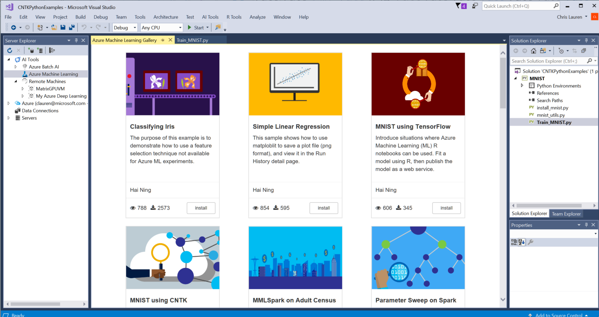
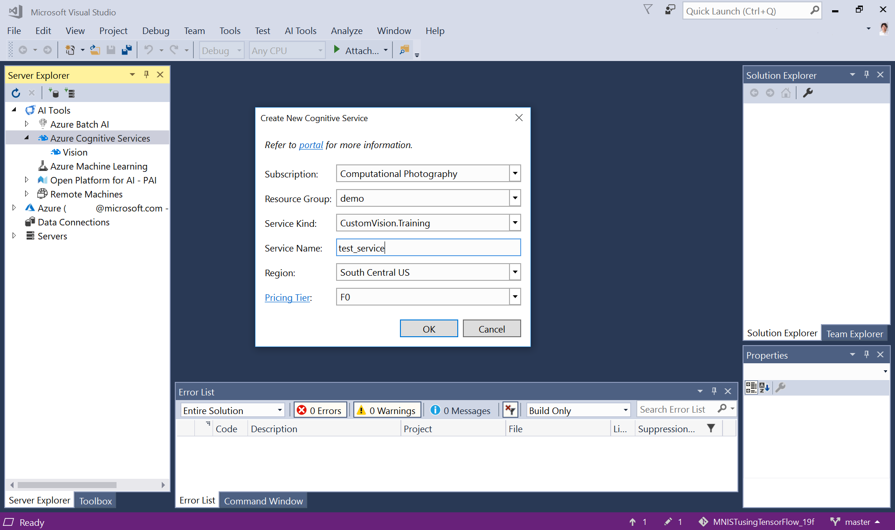
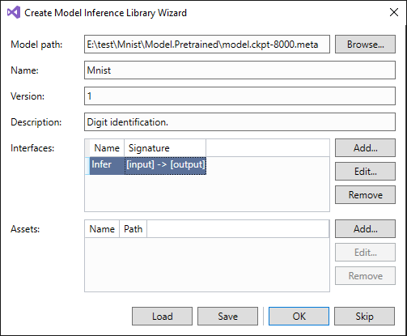

# Visual Studio Tools for AI

[English](/README.md)

Visual Studio Tools for AI是用来生成、测试、部署深度学习/人工智能解决方案的扩展。 它能与像Azure Machine Learning一样的人工智能云服务无缝集成，提供了一系列丰富的实验能力。比如，将数据和训练作业透明的提交到不同的计算对象上。 此外，还有训练历史跟踪，自定义指标等功能，能提供数据科学中的跟踪和重现的能力。 它的企业级的协作能力，为多人在同一个项目上的合作提供了足够的安全保障。

使用[微软认知工具包 (CNTK)](http://www.microsoft.com/en-us/cognitive-toolkit)，[Google TensorFlow](https://www.tensorflow.org)，[PyTorch](https://pytorch.org/)，[Apache MXNet](https://mxnet.incubator.apache.org/)或其它框架现在就开始上手。

## 快速链接

**准备工作**

- [发行说明](docs/release-notes.md)
- [安装](docs/installation.md)
- [准备开发环境](docs/prepare-localmachine.md)
- [深度学习示例](https://github.com/Microsoft/samples-for-ai)
- [常见问题](docs/faq.md)

**快速入门**

- [Tensorflow + Python](docs/tensorflow-local.md)
- [从Azure示例集中创建AI项目](docs/quickstart-00-project-from-azuremachinelearning-gallery.md)
- [从已有的代码创建AI项目](docs/quickstart-01-project-from-existing.md)
- [从模板创建AI项目](docs/quickstart-02-project-from-template.md)
- [从示例代码仓库创建AI项目](docs/quickstart-03-project-from-repository.md)
- [在Azure Batch AI上用TensorFlow来训练MINST数据集](docs/quickstart-04-train-azure-batchai.md)

**教程**

- [用TensorBoard来监控& 可视化](docs/monitor-tensorboard.md)
- [监控作业历史](docs/job-history.md)
- [管理存储](docs/manage-storage.md)
- [监控GPU使用情况](docs/gpu-utilization.md)
- [TensorFlow + Azure深度学习虚拟机](docs/tensorflow-vm.md)
- [使用微软认知服务为应用加入人工智能](docs/cognitive-services.md)
- [用预训练的模型构建智能应用](docs/model-inference.md)
- [将训练好的模型转换为ONNX](docs/model-converter.md)
- [查看AI模型的网络架构和参数](docs/model-viewer.md)

## 支持的操作系统

Visual Studio Tools for AI仅支持**64位**Windows操作系统。 推荐使用Windows 10来获得最佳的兼容性。

## 支持的Visual Studio版本

Visual Studio Tools for AI可用于Windows上的Visual Studio 2017/2015。 支持[社区版](https://www.visualstudio.com/downloads/)，专业版以及企业版。

可在Visual Studio MarketPlace上找到这两个 [VS 2017](https://marketplace.visualstudio.com/items?itemName=ms-toolsai.vstoolsai-vs2017), 和[VS 2015](https://marketplace.visualstudio.com/items?itemName=ms-toolsai.vstoolsai-vs2015)扩展包。 **开始下载时，文件包名有可能是".zip"。 请在下载后改为".vsix"，然后再安装。**

要下载Visual Studio Code版本，请查看[Visual Studio Code Tools for AI](http://aka.ms/vscodetoolsforai)

## 开发、调试，并部署深度学习模型和AI解决方案

现在就用Visual Studio产品级的功能来加速AI创新。 使用内置的代码编辑器来获得语法高亮、智能提醒和自动格式化等功能。 你能在本地环境中，用单步调试来查看本地变量和模型，测试深度学习应用。

[进一步学习如何在Visual Studio中创建深度学习项目](docs/quickstart-02-project-from-template.md)

## 使用Azure Machine Learning样例集快速入门

Visual Studio Tools for AI与Azure Machine Learning集成在一起，能够很容易的浏览CNTK、TensorFlow、MMLSpark及其它组件创建的样例库。

[进一步学习如何从样例集创建项目](docs/quickstart-00-project-from-azuremachinelearning-gallery.md)

## 在云端加速深度学习模型和推理

Visual Studio Tools for AI能够轻松的在本机上训练模型，或通过集成的Azure Machine Learning将任务提交到云端。 你可以将任务提交到不同的计算平台，如Spark集群，Azure GPU虚拟机等等。

[进一步了解如何在云端训练模型](docs/tensorflow-vm.md)

## 使用微软认知服务为应用加入人工智能

[微软认知服务](https://azure.microsoft.com/en-us/services/cognitive-services/)是一组API，SDK和服务，它能用几行代码，就帮助开发人员让应用变得更智能，又更吸引人。 Visual Studio Tools for AI能很容易的在Visual Studio中发现、创建和自定义认知服务。

[了解微软认知服务的更多信息](docs/cognitive-services.md)

## 用预训练的模型构建智能应用

在Visual Studio中将预训练模型加入到应用中非常容易，就像增加其它库和资源一样。 Visual Studio Tools for AI包含了[Microsoft.ML.Scoring](https://www.nuget.org/packages/Microsoft.ML.Scoring/)库，它提供了面向TensorFlow和ONNX模型的一致的API。

此外Visual Studio Tools for AI还生成了基础类来简化与模型的交互。 模型推理库项目还能作为NuGet包部署，来简化发布过程。

[了解使用预训练AI模型的更多内容](docs/model-inference.md)

## 通过模型文件转换来实现不同AI框架间的互操作。

产生了大量的AI框架来让用户构建自己的模型。 但是，它们在实现细节上有很多差异。 这样的结果是，一个框架生成的模型不能在接下来的另一个框架下重用，进行下一步的训练或推理。这给用户在框架选择上带来了不便和成本。 模型文件转换工具是应对这类挑战的可行的尝试。

Visual Studio Tools for AI利用已有的模型转换工具，能很容易的将CoreML，TensorFlow，scikit-learn，XGBoost和LIBSVM模型转换为[ONNX](https://onnx.ai/)格式。

[了解关于模型文件转换的更多信息](docs/model-converter.md)

# 支持

我们在[GitHub Issue Tracker](http://github.com/Microsoft/vs-tools-for-ai/issues)上提供此扩展的支持。 你可以报告bug，建议功能或参与讨论。

## 行为准则

该项目采用了 [ Microsoft 开源行为准则 ](https://opensource.microsoft.com/codeofconduct/)。 有关详细信息,请参阅 [ 行为守则常见问题解答 ](https://opensource.microsoft.com/codeofconduct/faq/) 或联系<opencode@microsoft.com>咨询问题或评论。

## 隐私声明

[Microsoft Enterprise and Developer Privacy Statement](https://go.microsoft.com/fwlink/?LinkId=786907&lang=en7)描述了此软件的隐私声明。

## 许可证

此扩展受[最终用户许可协议](https://www.visualstudio.com/license-terms/mlt552233/)条款的限制。