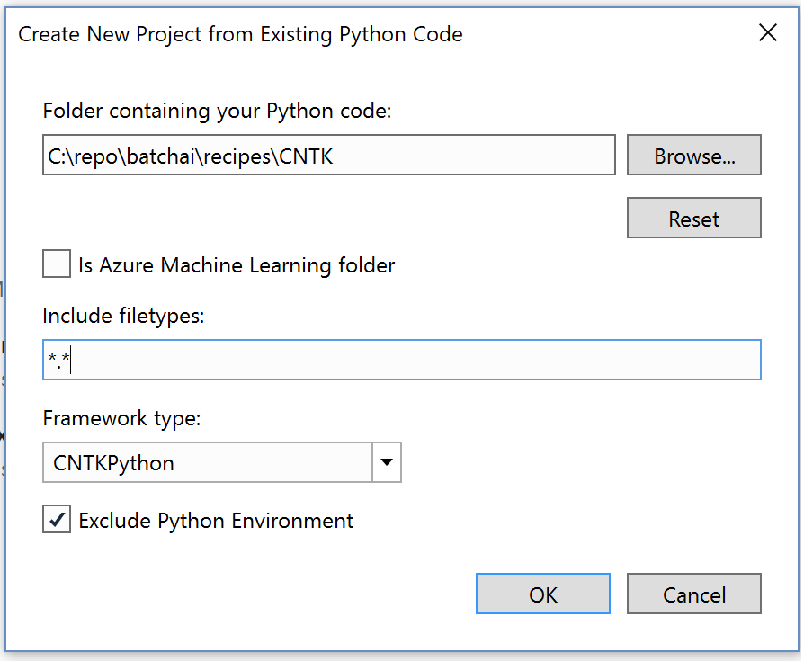

# 快速入门：从现有代码创建AI项目

在[安装Visual Studio Tools for AI](installation.md)后，能够轻松的将现有的Python代码导入到一个Visual Studio项目中。

> [!重要]
> 
> 此处描述的过程不会移动或复制原始的源文件。 如果想要在副本上操作，请先复制文件夹。

1. 运行Visual Studio 并选择**文件 > 新建 > 项目**。

2. 在 **新建项目**对话框中，搜索"**AI Tools**"，选择"**From Existing Python code**"模板，给项目命名并提供位置，然后点击**确定**。
    
    

3. 在出现的向导中，将路径设置到已有代码的位置，为文件类型设置一个过滤器，并指定项目要求的所有搜索路径，然后点击**OK**。 如果你不知道要搜索什么目录，将此输入框留空。
    
    

> 如果当前代码是Azure Machine Learning项目的一部分，选择"**Is Azure Machine Learning folder**"来确保能将重要的Azure Machine Learning配置信息转换成功，例如试验账户，工作区，使用的计算环境等等。

1. 要设置一个开始文件，在解决方案资源管理器找到文件，右击，然后选择**设置为启动文件**。

2. 如果需要，通过按下Ctrl+F5或选择 **调试 > 开始执行(不调试)** 来运行程序。

## 下一步

- [教程：在Visual Studio中使用Python](https://docs.microsoft.com/en-us/visualstudio/python/vs-tutorial-01-00)

## 参考

- [为已有的Python解释器创建环境](https://docs.microsoft.com/en-us/visualstudio/python/python-environments#creating-an-environment-for-an-existing-interpreter)