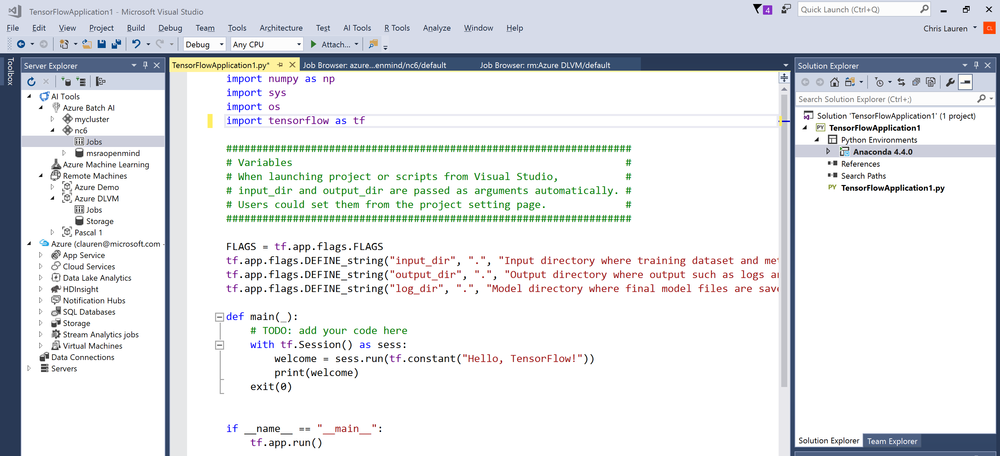
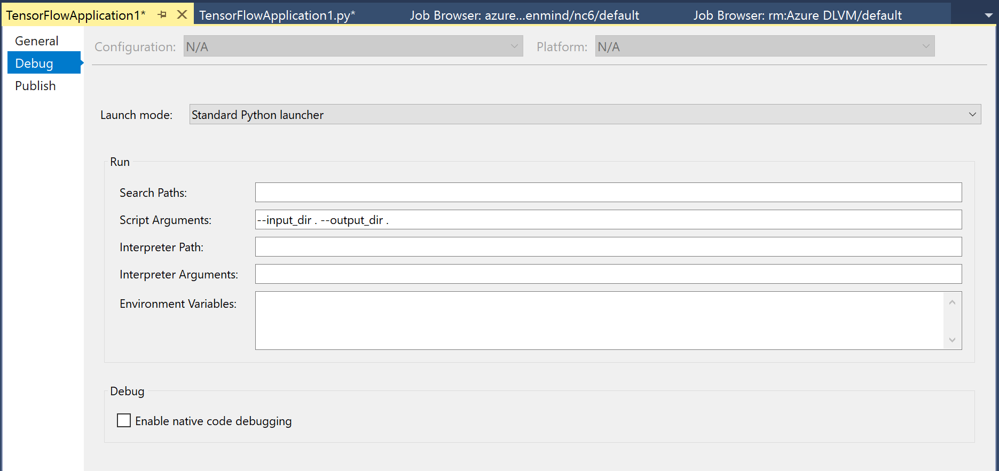

# 快速入门：从Visual Studio模板创建AI项目

在[安装Visual Studio Tools for AI](installation.md)后，能够很容易从各种模板中创建一个新的Python项目。

1. 启动Visual Studio。

2. 选择 **文件 > 新建 > 项目** (Ctrl+Shift+N)。 在**新建项目**对话框中，搜索"**AI Tools**"，并选择需要的模板。 注意，选中的模板会有一小段描述来说明模板提供了什么。
    
    

3. 此快速入门中，选择了"**TensorFlow Application**"模板，并给项目一个名称 (例如"MNIST") 以及位置，然后点击**确定**。

4. Visual Studio在磁盘上会创建项目文件 (`.pyproj`) 以及其它在模板中描述道的文件。 使用"TensorFlow Application"模板，项目里会包含一个和项目名称一样的文件。 这个文件默认会在Visual Studio编辑器中打开。
    
    

5. 注意，代码已经导入了几个库，包括TensorFlow，numpy，sys和os。 此外，它还支持在启动时输入一些参数，这样能够很容易的切换训练数据，输出模型和日志文件的位置。 这些参数在将作业提交到不同的计算环境中很有用（例如，本地开发环境的目录可能和Azure共享文件的路径是不一样的）。

6. 项目上还有些属性能够自动传入命令行参数，这样可以让调试起来更容易。 **右击**项目，并选择**属性**
    
    

7. 点击**调试**标签会看到脚本参数已经自动添加了。 可以根据需要来改变输入数据的存储位置，以及期望的输出数据的存储位置。
    
    

8. 通过按下Ctrl+F5或选择菜单栏 **调试 > 开始执行(不调试)** 来运行程序。 结果会显示在一个命令行窗口中。