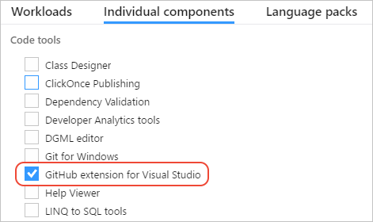
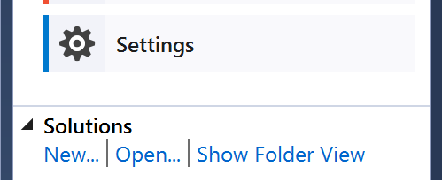
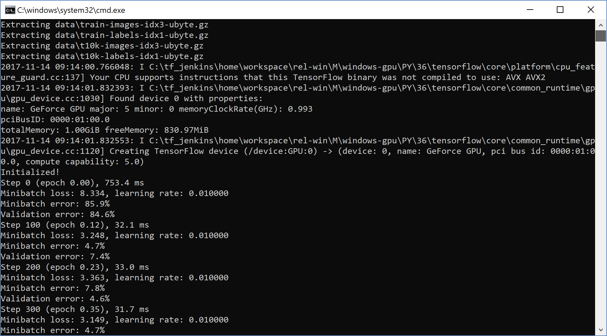

# 快速入门：在Visua Studio中克隆Python代码库

在[安装Visual Studio Tools for AI](installation.md)后，你可以很容易的通过克隆Python代码库来创建一个项目。

1. 要连接到GitHub代码库，运行Visual Studio Installer，选择**修改**，并选择**单个组件**标签。 滚动到**代码工具**章节或**最下方**，选择**GitHub extension for Visual Studio**，然后点击**修改**。
    
    

2. 启动Visual Studio。

3. 选择 **视图 > 团队资源管理器...** 来打开 **团队资源管理器** 窗口。在这里，可以连接到GitHub，Visual Studio Team Service或者克隆代码库。
    
    

4. 在**本地Git存储库**下的URL文本框中，输入`https://github.com/Microsoft/samples-for-ai`，并输入克隆的代码目录，然后点击**克隆**。
    
    > [!提示] 在团队资源管理器中指定的目录是用来接受克隆的文件的目录。 和`git clone`命令不同的是，在团队资源管理器中克隆代码，不会自动为代码库创建一个子文件夹。

5. 克隆完成后，双击团队资源管理器里的存储库文件夹来打开存储库面板。 在**解决方案**下，选择**新建...**。
    
    

6. 在**新建项目**对话框出现后，选择"**From Existing Python Code**"，给项目一个名字，将**位置**设置到存储库相同的目录下，并点击**确定**。 在出现的向导中，选择**Finish**。

7. 从菜单中选择**视图 > 解决方案资源管理器**。

8. 在解决方案资源管理器中，展开`TensorFlow Examples>MNIST`节点，右击`convolutional.py`，并选择**设置为启动文件**。 这一步告诉Visual Studio，当运行项目时，使用哪个文件启动。

9. 按下Ctrl+F5或选择 **调试 > 开始执行(不调试) ** 来运行程序。 如果看见一个`符号，再检查一下前一步设置的工作目录。

10. 当程序执行成功后，会看到它开始下载训练和测试数据集，然后训练模型并输出错误率。 会看到错误率随着时间变小
    
    

> 如果你在使用Anaconda，并出现了找不到numpy的错误。需要将python环境 [设置为使用Anaconda](https://docs.microsoft.com/en-us/visualstudio/python/python-environments)。

11. 可以通过TensorBoard来可视化进度。 右键点击项目，并点击**Run TensorBoard**，然后选择TensorBoard的输出日志的目录。
    
    

12. 注意，错误率随着时间会减小，表示质量在提高。
    
    